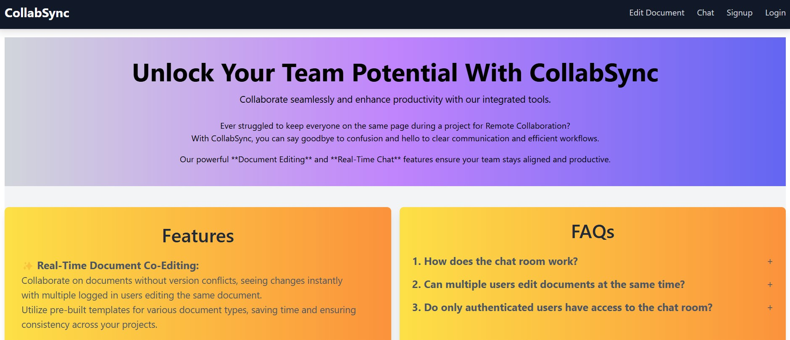

CollabSync: Real-Time Collaboration and Communication Platform

Features :

Real-Time Chat Room: Users can join a chat room, send messages, and receive them in real-time without page refreshes.

Collaborative Document Editing: Multiple users can edit a document in real-time. Changes made by one user are instantly reflected for all other users.

User Authentication: Users can sign up and log in to use the chat room and document editing features securely.

Socket.IO Integration: Real-time bi-directional communication between client and server, enabling real-time chat and document updates.

Technologies Used:

MongoDB: Database for storing user data, messages, and documents.

Express.js: Backend framework to handle routing and API requests.

React.js: Frontend framework to build the user interface.

Node.js: Runtime environment for the backend server.

Socket.IO: For real-time, event-based communication.

JWT (JSON Web Tokens): For user authentication.
